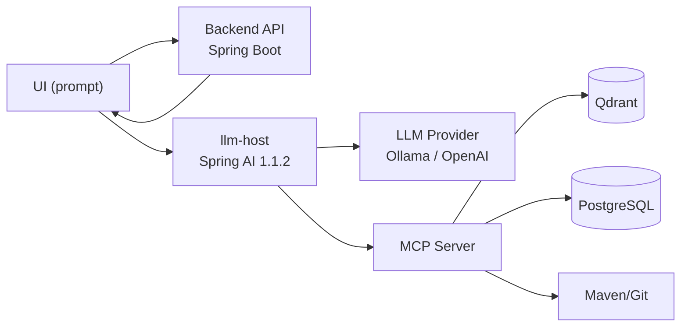
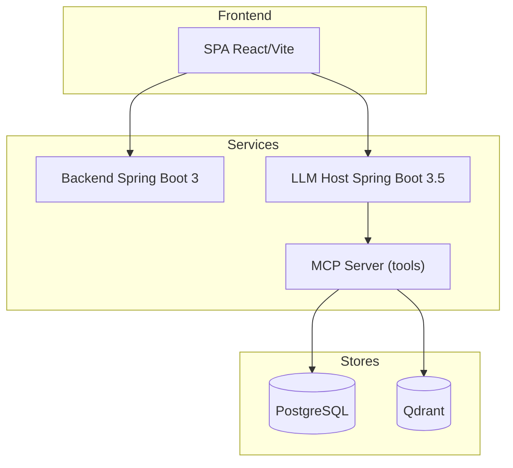
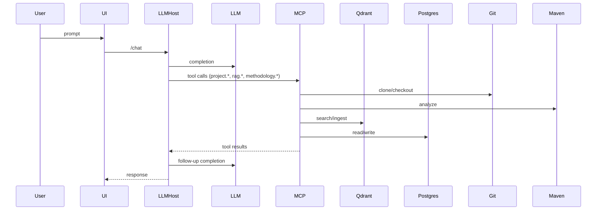

# Spring Boot Upgrade Assistant

Spring Boot Upgrade Assistant aide les équipes à analyser un dépôt Git et à estimer l'effort de migration d'une application Spring Boot vers une version cible (par exemple de 2.7.x vers 3.3.x). L'application orchestre une SPA React, un backend Spring Boot 3.x et des serveurs MCP outillés par un LLM afin de générer un rapport complet : changements attendus, impacts de code, vulnérabilités et workpoints.

## Architecture globale






- **Frontend (React/Vite)** : saisie d'un prompt libre et consultation de la réponse outillée.
- **Backend (Spring Boot 3, Java 21)** : API REST historique (analyses), logique métier et persistence Postgres.
- **LLM Host (Spring Boot 3.5 + Spring AI 1.1.2)** : reçoit un prompt, orchestre le modèle (Ollama ou OpenAI) et appelle les tools MCP via tool-calling.
- **Serveurs MCP** :
  - `mcp-project-analyzer` pour explorer le repo, les dépendances Maven et la version actuelle de Spring Boot.
  - `mcp-knowledge-rag` pour interroger la base vectorielle (Qdrant) avec les release notes, CVE et documentation.
  - `mcp-methodology` pour appliquer le calcul de workpoints.
  - `mcp-server` (MCP Streamable HTTP) expose les tools unifiés (méthodologie, analyse Maven, ingestion/search RAG) sans encore
    activer de tool-calling LLM.
- **Bases de données** : PostgreSQL pour l'état des analyses, Qdrant pour le RAG.

## Prérequis
- Docker et Docker Compose
- Java 21 et Maven 3.9+
- Node.js 18+ et npm
- Variable d'environnement `OPENAI_API_KEY` uniquement si vous activez le provider OpenAI (profil `prod`).
- Variable d'environnement `MCP_SERVER_URL` pour pointer vers le MCP Streamable HTTP (défaut: `http://mcp-server:8085/mcp`).

## Fournisseurs LLM/Embeddings (Spring AI)
- Abstraction unique via `ChatGateway` et `EmbeddingGateway`, implémentée avec Spring AI.
- Provider **par défaut** : Ollama (modèle chat `llama3.1:8b`, embeddings `nomic-embed-text`).
- Provider **prod** : OpenAI (`gpt-4o-mini` par défaut, embeddings `text-embedding-3-small`).

### Service `llm-host`
- Endpoint REST : `POST /chat` (ou `/runs`) avec `{ "prompt": "...", "dryRun": false }`.
- Tool-calling MCP : project.*, rag.*, methodology.* exposés par `mcp-server`.
- Traces : chaque réponse expose la liste des tool-calls (nom, durée, arguments). DRY_RUN force la planification sans exécution des tools.
- Variable `MCP_SERVER_URL` : URL du MCP Streamable HTTP, par exemple `http://localhost:8085/mcp` en local.

### Local LLM (Ollama)
1. Démarrer via Docker Compose (inclut `ollama` et le service `llm-host`)
   ```bash
   docker-compose up --build
   ```
2. Télécharger les modèles nécessaires (obligatoire au premier démarrage) :
   ```bash
   docker-compose exec ollama ollama pull llama3.1:8b
   docker-compose exec ollama ollama pull nomic-embed-text
   ```
3. Le profil `local` ou la propriété `APP_AI_PROVIDER=ollama` sélectionnent automatiquement les endpoints Ollama. `llm-host` écoute sur `http://localhost:8082`.

### Production (OpenAI)
1. Exporter la clé API :
   ```bash
   export OPENAI_API_KEY="sk-..."
   ```
2. Activer le profil `prod` ou définir `APP_AI_PROVIDER=openai`.
3. Les modèles peuvent être personnalisés via `OPENAI_CHAT_MODEL` et `OPENAI_EMBEDDING_MODEL`.

### Basculer de provider
- Par propriété : `APP_AI_PROVIDER=ollama|openai` (par défaut : `ollama`).
- Par profil Spring : `SPRING_PROFILES_ACTIVE=local|prod`.
- Les configurations sont regroupées dans `application.yml` + overlays `application-local.yml` et `application-prod.yml`.

Exemple de prompt côté UI/llm-host :
```
Voici le lien de mon projet git https://github.com/xxx/yyy. Analyse les release notes Spring Boot 3.3.3 et donne-moi un rapport,
limite-toi aux dépendances Spring et propose des workpoints.
```

## MCP Tools Catalog
Le `llm-host` accède aux tools exposés par `mcp-server`. Chaque tool ci-dessous est disponible via MCP tool-calling **et** via les endpoints REST `/api/*`.

| Tool | Description | Inputs (JSON schema) | Outputs (JSON schema) | Notes |
| --- | --- | --- | --- | --- |
| `project.clone` | Clone un dépôt Git dans un workspace local. | `{"type":"object","properties":{"repoUrl":{"type":"string"},"branch":{"type":"string","nullable":true},"authRef":{"type":"string","nullable":true}},"required":["repoUrl"]}` | `{"type":"object","properties":{"workspaceId":{"type":"string"},"path":{"type":"string"}},"required":["workspaceId","path"]}` | `authRef` est un token (jamais loggué). |
| `project.analyzeMaven` | Analyse le pom.xml et les dépendances Maven. | `{"type":"object","properties":{"workspaceId":{"type":"string"}},"required":["workspaceId"]}` | `{"type":"object","properties":{"springBootVersionDetected":{"type":"string"},"springDependencies":{"type":"array","items":{"type":"string"}},"thirdPartyDependencies":{"type":"array","items":{"type":"string"}},"javaVersionDetected":{"type":"string"}}}` | Scope Spring-only disponible via `project.detectSpringScope`. |
| `project.indexCodeToRag` | Indexe le code source dans Qdrant avec embeddings. | `{"type":"object","properties":{"workspaceId":{"type":"string"},"options":{"type":"object","properties":{"chunkSize":{"type":"integer"},"chunkOverlap":{"type":"integer"},"normalizeWhitespace":{"type":"boolean"}}}},"required":["workspaceId"]}` | `{"type":"object","properties":{"workspaceId":{"type":"string"},"filesProcessed":{"type":"integer"},"chunksStored":{"type":"integer"},"chunksSkipped":{"type":"integer"}}}` | Utilise `mcp.rag.chunk-size` par défaut si options absentes. |
| `project.detectSpringScope` | Filtre les dépendances Spring. | `{"type":"object","properties":{"dependencies":{"type":"array","items":{"type":"string"}}},"required":["dependencies"]}` | `{"type":"array","items":{"type":"string"}}` | Pratique pour limiter les analyses au scope Spring. |
| `rag.ingestFromHtml` | Ingère une page HTML dans le RAG. | `{"type":"object","properties":{"url":{"type":"string"},"sourceType":{"type":"string"},"library":{"type":"string"},"version":{"type":"string"},"docId":{"type":"string"},"selectors":{"type":"array","items":{"type":"string"}}},"required":["url","sourceType","library","version"]}` | `{"type":"object","properties":{"documentHash":{"type":"string"},"chunksStored":{"type":"integer"},"chunksSkipped":{"type":"integer"},"warnings":{"type":"array","items":{"type":"string"}}}}` | `url` doit être dans l'allowlist. |
| `rag.ingestText` | Ingère un texte brut. | `{"type":"object","properties":{"sourceType":{"type":"string"},"library":{"type":"string"},"version":{"type":"string"},"content":{"type":"string"},"url":{"type":"string"},"docId":{"type":"string"}},"required":["sourceType","library","version","content"]}` | `{"type":"object","properties":{"documentHash":{"type":"string"},"chunksStored":{"type":"integer"},"chunksSkipped":{"type":"integer"},"warnings":{"type":"array","items":{"type":"string"}}}}` | Idempotent par `documentHash`. |
| `rag.search` | Recherche des chunks dans Qdrant. | `{"type":"object","properties":{"query":{"type":"string"},"filters":{"type":"object"},"topK":{"type":"integer"}},"required":["query"]}` | `{"type":"array","items":{"type":"object","properties":{"text":{"type":"string"},"score":{"type":"number"},"metadata":{"type":"object"}}}}` | `filters` sont appliqués côté client dans `rag.findApiChanges`. |
| `rag.ensureBaselineIngested` | Vérifie les ingestions baseline. | `{"type":"object","properties":{"targetSpringVersion":{"type":"string"},"libs":{"type":"array","items":{"type":"string"}}},"required":["targetSpringVersion","libs"]}` | `{"type":"object","properties":{"targetSpringVersion":{"type":"string"},"missingDocuments":{"type":"array","items":{"type":"string"}}}}` | Utilisé pour vérifier l'état des sources RAG. |
| `rag.ingestSpringSource` | Ingère le code source Spring Framework (multi-versions). | `{"type":"object","properties":{"version":{"type":"string"},"modules":{"type":"array","items":{"type":"string"}},"includeGlobs":{"type":"array","items":{"type":"string"}},"excludeGlobs":{"type":"array","items":{"type":"string"}},"includeTests":{"type":"boolean"},"includeNonJava":{"type":"boolean"},"maxFiles":{"type":"integer"},"maxFileBytes":{"type":"integer"},"maxLinesPerFile":{"type":"integer"},"force":{"type":"boolean"},"chunkSize":{"type":"integer"},"chunkOverlap":{"type":"integer"},"includeKotlin":{"type":"boolean"}},"required":["version"]}` | `{"type":"object","properties":{"version":{"type":"string"},"modulesRequested":{"type":"array","items":{"type":"string"}},"filesScanned":{"type":"integer"},"filesIngested":{"type":"integer"},"filesSkipped":{"type":"integer"},"skipReasons":{"type":"object"},"durationMs":{"type":"integer"}}}` | Repo fixée à `spring-projects/spring-framework`. |
| `rag.findApiChanges` | Compare les changements API via RAG entre deux versions. | `{"type":"object","properties":{"symbol":{"type":"string"},"fromVersion":{"type":"string"},"toVersion":{"type":"string"},"topK":{"type":"integer"}},"required":["symbol","fromVersion","toVersion"]}` | `{"type":"object","properties":{"symbol":{"type":"string"},"fromVersion":{"type":"string"},"toVersion":{"type":"string"},"summary":{"type":"string"},"fromMatches":{"type":"array","items":{"type":"object"}},"toMatches":{"type":"array","items":{"type":"object"}}}}` | V1 = comparaison RAG (pas un diff Git). |
| `methodology.getRules` | Retourne les règles de méthodologie. | `{"type":"object","properties":{}}` | `{"type":"object","properties":{"version":{"type":"string"},"rules":{"type":"array","items":{"type":"string"}}}}` | Utilisé pour l'exposition des règles de calcul. |
| `methodology.computeWorkpoints` | Calcule les workpoints depuis une liste de changements. | `{"type":"object","properties":{"changesJson":{"type":"string"}},"required":["changesJson"]}` | `{"type":"object","properties":{"totalWorkpoints":{"type":"integer"},"breakdown":{"type":"array","items":{"type":"object"}},"methodologyVersion":{"type":"string"}}}` | `changesJson` est une liste JSON sérialisée de `WorkpointChange`. |

## Allowed LLM tool calls (garde-fous)
- **Max tool calls par run** : `app.tooling.maxToolCalls` (défaut: 6).
- **Timeout tool** : `app.tooling.toolTimeoutSeconds` (défaut: 90s).
- **Allowlist HTML ingest** : `mcp.rag.allowlist` (défaut: `https://docs.spring.io`, `https://github.com`).
- **Ingestion Spring source** : repo fixée à `https://github.com/spring-projects/spring-framework`.
- **Max content length** : `mcp.rag.max-content-length` (défaut: 1 048 576 bytes).
- **Chunking** : `mcp.rag.chunk-size` (défaut: 800), `mcp.rag.chunk-overlap` (défaut: 80).
- **Limite fichiers Spring** : `mcp.spring-source.default-max-files` (défaut: 2000), override par `maxFiles`.

## Exemples de prompts (Spring-only)
- "Clone le dépôt https://github.com/acme/mon-app, détecte les dépendances Spring, puis propose les workpoints."
- "Compare l'API de `org.springframework.web.client.RestTemplate` entre Spring Framework 6.1.5 et 6.1.6."
- "Ingest Spring Framework 6.1.5, puis recherche les changements sur `WebClient`."

## Build et exécution locale
1. **LLM Host**
   ```bash
   cd llm-host
   mvn clean package
   mvn spring-boot:run -Dspring-boot.run.profiles=local
   ```
   Endpoint de chat : `http://localhost:8082/chat`.

2. **Backend** (optionnel si seul le prompt est utilisé)
   ```bash
   cd backend
   mvn clean package
   mvn spring-boot:run
   ```
   Par défaut, l'API historique écoute sur `http://localhost:8080`.

3. **Frontend**
   ```bash
   cd frontend
   npm install
   npm run build
   npm run dev -- --host --port 3000
   ```
   L'interface est disponible sur `http://localhost:3000` et cible `llm-host` via `VITE_LLM_HOST_URL`.

## Démarrage avec Docker Compose
1. Exporter la clé OpenAI :
   ```bash
   export OPENAI_API_KEY="sk-..."
   ```
2. Construire et lancer l'ensemble (backend, frontend, Postgres, Qdrant, MCP) :
   ```bash
   docker-compose up --build
   ```
3. Points d'accès :
   - Frontend : http://localhost:3000
   - Backend : http://localhost:8080
   - Qdrant : http://localhost:6333
   - MCP Server : http://localhost:8085 (transport Streamable HTTP `/mcp`)
  - MCP Inspector : http://localhost:6274 (UI d'exploration des tools MCP)
   - PostgreSQL : localhost:5432 (db `upgrader`, utilisateur/mot de passe `upgrader`)

Exemple de configuration Docker Compose pour garantir la résolution réseau `mcp-server` côté `llm-host` :
```yaml
services:
  llm-host:
    environment:
      MCP_SERVER_URL: http://mcp-server:8085/mcp
    depends_on:
      - mcp-server
  mcp-server:
    ports:
      - "8085:8085"
```

## Stockage persistant & nettoyage
- **Volumes Docker** :
  - `qdrant-data` : embeddings et documents RAG.
  - `workspace-data` : clones temporaires de projets analysés.
  - `spring-cache-data` : cache Git du repo `spring-framework`.
- Les sources Spring peuvent représenter plusieurs centaines de Mo selon les versions ingérées.
- Nettoyage rapide :
  ```bash
  docker volume rm release-assitant_qdrant-data release-assitant_workspace-data release-assitant_spring-cache-data
  ```

## Accéder à la documentation Swagger UI
- **Backend (API principale)** : http://localhost:8080/swagger-ui/index.html
- **MCP Knowledge RAG** : http://localhost:8081/swagger-ui/index.html
- Une fois les services démarrés (via Maven ou Docker Compose), ces URLs exposent le catalogue OpenAPI pour tester les endpoints et vérifier la configuration.

## Ingestion des connaissances RAG (offline)
- Le script `scripts/ingest-baseline.zsh` lit `rag_sources/sources.csv` (séparateur `;`) et appelle l'API REST interne du `mcp-server` (`/api/rag/ingest/html`).
- L'endpoint est idempotent grâce aux métadonnées `documentHash` et `chunkHash` : une source déjà ingérée est ignorée.
- Variables attendues :
  - `RAG_BASE_URL` (ex: `http://localhost:8085` via docker-compose)
  - `DRY_RUN` (`true/false`, affiche les payloads sans ingestion)

Exemple d'exécution :
```bash
export RAG_BASE_URL="http://localhost:8085"
DRY_RUN=true ./scripts/ingest-baseline.zsh   # vérifie les payloads
./scripts/ingest-baseline.zsh                # ingère réellement dans Qdrant
```

### Ingestion du code source Spring Framework (offline)
- Le script `scripts/ingest-spring-sources.zsh` lit `rag_sources/spring_versions.txt` (une version par ligne).
- Appelle l'API REST `POST /api/rag/ingest/spring-source` du `mcp-server`.
- Variables utiles :
  - `RAG_BASE_URL` (ex: `http://localhost:8085`)
  - `DRY_RUN` (`true/false`)
  - `MODULES` (liste séparée par virgules, ex: `spring-core,spring-web`)
  - `MAX_FILES`, `INCLUDE_TESTS`, `FORCE`

Exemple :
```bash
export RAG_BASE_URL="http://localhost:8085"
DRY_RUN=true ./scripts/ingest-spring-sources.zsh
MODULES="spring-core,spring-web" ./scripts/ingest-spring-sources.zsh
```

Exemples d'appels directs :

- Minimal :
  ```bash
  curl -sS -X POST "$RAG_BASE_URL/api/rag/ingest/spring-source" \\
    -H 'Content-Type: application/json' \\
    -d '{\"version\":\"6.1.4\"}'
  ```
- Modules ciblés :
  ```bash
  curl -sS -X POST "$RAG_BASE_URL/api/rag/ingest/spring-source" \\
    -H 'Content-Type: application/json' \\
    -d '{\"version\":\"6.1.4\",\"modules\":[\"spring-core\",\"spring-web\"]}'
  ```
- Inclure les tests :
  ```bash
  curl -sS -X POST "$RAG_BASE_URL/api/rag/ingest/spring-source" \\
    -H 'Content-Type: application/json' \\
    -d '{\"version\":\"6.1.4\",\"includeTests\":true}'
  ```
- Forcer la ré-ingestion :
  ```bash
  curl -sS -X POST "$RAG_BASE_URL/api/rag/ingest/spring-source" \\
    -H 'Content-Type: application/json' \\
    -d '{\"version\":\"6.1.4\",\"force\":true}'
  ```

## Tester le MCP server (sans LLM)
- Démarrer via Docker Compose (`mcp-server` écoute sur `8085`).
- Les tools sont exposés via le transport Streamable HTTP `/mcp` et via des endpoints REST pratiques :
  - `POST /api/rag/ingest/html` pour ingérer une page.
  - `POST /api/rag/ingest/text` pour injecter un contenu brut.
  - `POST /api/rag/ingest/spring-source` pour ingérer le code source Spring Framework.
  - `POST /api/rag/search` pour interroger Qdrant.
  - `POST /api/rag/api-changes` pour comparer des snippets entre versions.
- Les outils `methodology.*` et `project.*` sont déclarés avec `@Tool` et scannés automatiquement grâce à Spring AI 1.1.2.

## Supervision et inspection du `mcp-server`
- **Actuator Spring Boot** : disponible sur `http://localhost:8085/actuator`.
  - `GET /actuator/health`, `/actuator/health/liveness` et `/actuator/health/readiness` permettent de vérifier la disponibilité du serveur MCP avant d'enchaîner les appels tools.
  - `GET /actuator/info` expose les métadonnées de build, et `/actuator/metrics` liste les métriques disponibles.
- **MCP Inspector** : conformément à la documentation officielle (https://modelcontextprotocol.io/docs/tools/inspector), l'UI `mcp-inspector` est incluse dans le `docker-compose`.
  1. Lancer `docker-compose up --build` pour démarrer `mcp-server` et l'inspector.
  2. Ouvrir http://localhost:5173 puis utiliser l'URL MCP `http://mcp-server:8085/mcp` (préconfigurée via `MCP_SERVER_URL` et accessible depuis l'UI). Depuis le navigateur hôte, vous pouvez aussi saisir `http://localhost:8085/mcp`.
  3. L'interface permet de lister les tools `project.*`, `rag.*` et `methodology.*`, d'inspecter les schémas et de déclencher des requêtes MCP sans passer par le LLM.
- Pour un lancement manuel en dehors de Docker Compose, suivez la documentation officielle et démarrez l'inspector en ciblant votre serveur MCP, par exemple :

  ```bash
  npx @modelcontextprotocol/inspector --server http://localhost:8085/mcp
  ```

## Endpoints principaux du backend
- `POST /analyses` : lancer une nouvelle analyse à partir d'un repo et d'une version cible.
- `GET /analyses` : lister les analyses déjà enregistrées.
- `GET /analyses/{id}` : consulter le détail d'une analyse.

## Flux fonctionnel type
1. L'utilisateur saisit l'URL du dépôt Git, un token d'accès si nécessaire et la version cible de Spring Boot depuis la SPA.
2. Le backend transmet au LLM un prompt orchestrant les appels aux serveurs MCP.
3. Les MCP analysent le dépôt, interrogent le RAG et appliquent la méthodologie de calcul des workpoints.
4. Le LLM renvoie un JSON structuré avec les changements, impacts de code, vulnérabilités et points d'effort.
5. Le backend persiste les résultats, et l'UI expose un rapport de migration.

## Travaux futurs
- Intégration complète des flux MCP côté LLM pour une exécution de bout en bout.
- UI plus avancée (historique, filtres, export PDF/HTML).
- Automatisation de l'ingestion des release notes et CVE dans Qdrant.
- Hooks CI pour analyser automatiquement les pull requests de migration.
